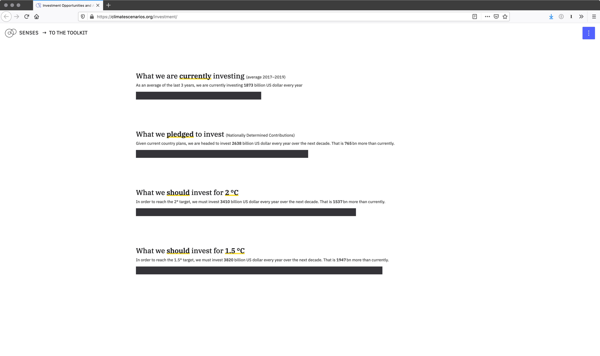
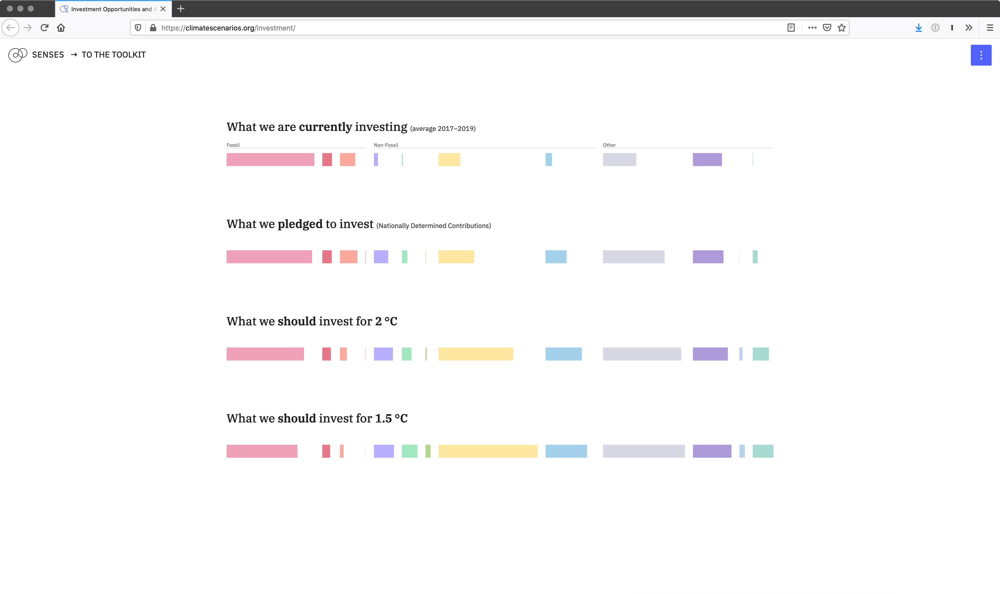
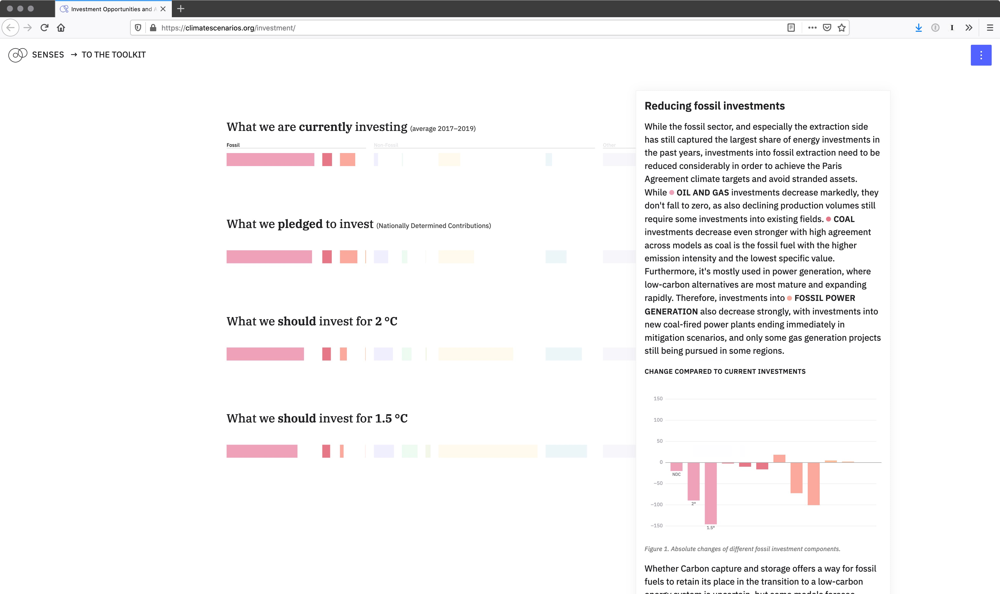
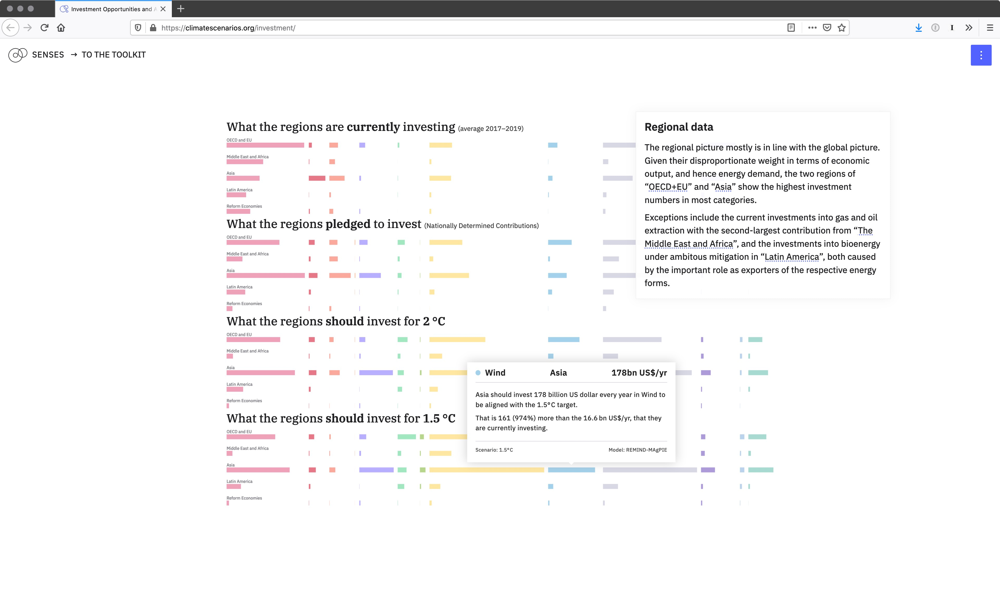

# Investment Opportunities and Alignment
## The climate targets of the Paris Agreement can only be reached with a profound shift in energy system investments over the coming decade.

Christoph Bertram, Bas van Ruijven and Jonas Parnow

The 1.5 and 2 °C climate targets of the Paris Agreement can only be reached with a profound shift in energy system investments over the coming decade. As described in the 1.5 Special Report by the IPCC, the world needs to bring the global CO2 emissions down to zero in the next 3–5 decades. This requires a complete transformation of the energy system that is currently characterised by a dominance of fossil fuels towards a system shaped by high efficiency, broad electrification of end-uses and decarbonised power supply, mainly via renewables.

Because energy systems require long-lived capital stocks, these investments need to be shifted immediately. The Paris Agreement points to this crucial role of investment flows by requiring “finance flows [to be] consistent with a pathway towards low greenhouse gas emissions and climate-resilient development.” The module visualises how this flow needs to change in size and composition and thus not only reveals alignments to also opportunities for financial actors.

The module is extending the static figure 2 from McCollum, D. L. et al. (2018) into an interactive, explanatory and exploratory graphic. The module uses updated data and guides the user step by step through the chart. The chart becomes more complex by splitting up from a macro perspective into a micro perspective and thus allowing the reader to compare investments per region, scenario, model and energy type.

---

This repository contains the code for [*Investment Opportunities and Alignment*](https://climatescenarios.org/investment-opportunities), a learn module on the required energy system transformation. It is part of the [SENSES Toolkit](https://climatescenarios.org/).







## License

The source code is licensed under the [ISC license](LICENSE.md). Text and graphics are licensed under [Attribution-ShareAlike 4.0 International](https://creativecommons.org/licenses/by-sa/4.0/). For licensing information on datasets please refer to the data sources section. Exceptions are listed below on a per-file basis.

## Data Sources

Data sources and if applicable licenses are listed below on a per-file basis.

- `preprocessing/sources/historic_investment.csv` [Source on Github CEDS](https://github.com/JGCRI/CEDS/); [License on Github](https://github.com/JGCRI/CEDS/#license-section)
- `preprocessing/sources/41560_2018_179_MOESM2_ESM-1.csv` Source: [IAMC 1.5°C Scenario Explorer and Data hosted by IIASA](https://data.ene.iiasa.ac.at/iamc-1.5c-explorer/#/about); [License for the IAMC 1.5°C scenario ensemble data](https://data.ene.iiasa.ac.at/iamc-1.5c-explorer/#/license)

## Build Setup

``` bash
# install dependencies
$ npm run install

# serve with hot reload at localhost:3000
$ npm run dev

# build for production and launch server
$ npm run build
$ npm run start

# generate static project
$ npm run build && npm run generate
```
